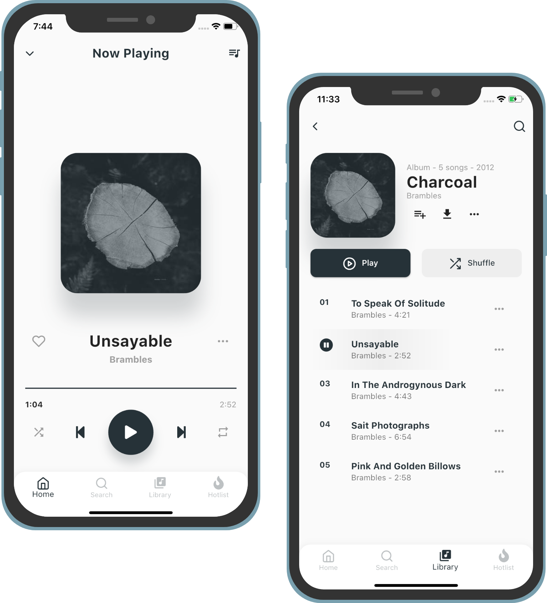

<h1 align="center">
    
</h1>

  <a href="#-technology">Tecnologias</a>&nbsp;&nbsp;&nbsp;|&nbsp;&nbsp;&nbsp;
  <a href="#-project">Projeto</a>&nbsp;&nbsp;&nbsp;|&nbsp;&nbsp;&nbsp;
  <a href="#-layout">Layout</a>&nbsp;&nbsp;&nbsp;|&nbsp;&nbsp;&nbsp;
  <a href="#-how-to-contribute">Como contribuir</a>&nbsp;&nbsp;&nbsp;|&nbsp;&nbsp;&nbsp;
  <a href="#memo-license">Licença</a>

  <row>
    
    
    
    
  </row>

 

  

## 🚀 Technology

This project was development with:

- [Flutter](https://flutter.dev/)

## 💻 Project

this project is an implementation of a user interface found on instagram. The objective of the challenge of this challenge is to improve myself in the creation of different layouts and to increasingly learn from it

## 🔖 Layout

The user interface for this project was created by Anton Lapko (UI / UX Design). You can find your portfolio on [Dribble](https://dribbble.com/anronkai) or on your [@anronkai](https://www.instagram.com/anronkai/) Instragram profile.

## 🤔 How to contribute?

- Fork this repository;
- Create a branch with your feature: `git checkout -b feature/your_feature_name`;
- Commit your changes: `git commit -m 'feat: My new feature'`;
- Push your commit to your branch: `git push origin feature/your_feature_name`.

After the merge of your pull request is done, you can delete your branch.

## :memo: License

This project is under the MIT license. See the [LICENSE] file (LICENSE.md) for more details.

---

Create with ♥ by Michael Martins
